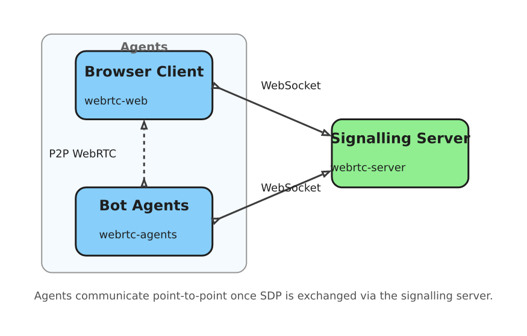

# WebRTC-Chat 

A browser-to-browser P2P chat application built on WebRTC data channels, with a lightweight signalling server and a suite of programmable bot agents. All messages and file transfers flow directly between peers—no server-side message storage.

## What It Does

- **P2P Text Chat** — Real-time messaging between browser peers over encrypted WebRTC data channels.
- **File Transfers** — Send files (images, videos, documents, etc.) through a dedicated binary data channel with progress tracking and receiver backpressure.
- **Audio Streaming** — The MusicBot can stream Opus-encoded audio tracks (sine waves, white noise, or OGG files) directly to peers via RTP.
- **Bot Agents** — Headless Go programs that connect as peers and offer automated interactions:
  - **EchoBot** — repeats everything you say.
  - **CounterBot** — counts messages.
  - **ClockBot** — tells the time.
  - **MusicBot** — streams audio tracks on demand (`/play`, `/list`).
  - **ChatBot** — LLM-powered replies via OpenRouter.
- **OAuth Authentication** — Supports GitHub and Kioubit login, with anonymous access allowed.
- **Message Features** — Message acknowledgements (ACKs), edits, deletions, unread tracking, and rich text support.
- **Connection Diagnostics** — RTT/ping over both WebSocket and WebRTC data channels, ICE restart on failure.

## Architecture



The **signalling server** (`webrtc-server`) only brokers SDP offers/answers and ICE candidates over WebSocket. Once the peer connection is established, all chat messages, file chunks, pings, and audio tracks travel directly between peers.

## Project Structure

| Directory | Purpose | Tech |
|---|---|---|
| [`webrtc-web/`](webrtc-web/) | Browser SPA — chat UI, WebRTC peer management, file handling | Next.js 16, React 19, TypeScript, Material UI |
| [`webrtc-server/`](webrtc-server/) | Signalling server, connection registry, OAuth handlers, management API | Go 1.24, Gorilla WebSocket |
| [`webrtc-agents/`](webrtc-agents/) | Headless bot peers that connect to the signalling server and chat over data channels | Go, Pion WebRTC v4, Opus |
| [`coturn-deploy/`](coturn-deploy/) | STUN/TURN server deployment notes and configs | coturn |
| [`fakecerts/`](fakecerts/) | Helper scripts to generate local CA and certificates for testing | CFSSL |

### Entry Points

- **Web UI**: [`webrtc-web/app/page.tsx`](webrtc-web/app/page.tsx)
- **Signalling Server**: [`webrtc-server/main.go`](webrtc-server/main.go)
- **Bot Agents**: [`webrtc-agents/cmd/agents/main.go`](webrtc-agents/cmd/agents/main.go)

## Key Concepts

### Signalling

Peers never connect out of thin air. They open a WebSocket to `webrtc-server`, register with a node name, and use the server to relay:
- **SDP Offers/Answers** — negotiate the peer connection parameters.
- **ICE Candidates** — discover public network paths (NAT traversal).

The server is a dumb pipe for signalling. It does **not** see message content.

### Data Channels

After signalling completes, the browser and bots communicate over labelled data channels:

| Label | Purpose |
|---|---|
| `chat` | Text messages, ACKs, edits, deletes |
| `file` | Binary file chunk transfer (ArrayBuffer) |
| `ping` | Data-channel-level RTT measurement |
| `msgpatch` | Streaming message patches (e.g. live typing) |

Audio is sent over a separate **RTP audio track** (not a data channel) using the Opus codec at 48 kHz stereo.

### Authentication

The server supports three auth modes per connection:
- **Anonymous** — no credentials, auto-assigned username (`user0001`, etc.).
- **Session** — cookie-based session after OAuth login.
- **JWT** — bearer tokens, used by bot agents to authenticate to the management API.

Supported identity providers: GitHub OAuth, Kioubit (Sign in with Kioubit).

## Quick Start

### Prerequisites

- Node.js 20+ and npm
- Go 1.24+
- (Optional) `libopus-dev` and `pkg-config` if building agents locally

### 1. Start the Signalling Server

```bash
cd webrtc-server
go run main.go --listen-addr=:3001
```

### 2. Start the Web Frontend

```bash
cd webrtc-web
npm install
npm run dev
```

Open [http://localhost:3000](http://localhost:3000).

### 3. (Optional) Run the Bots

```bash
cd webrtc-agents
go run cmd/agents/main.go \
  --ws-server=ws://localhost:3001/ws \
  --chatbot-model=openai/gpt-4o-mini
```

The agents will connect to the signalling server and appear as peers in the web UI.

### Environment Variables

Both the server and agents read `.env` files via `godotenv`.

| Variable | Used By | Description |
|---|---|---|
| `GH_LOGIN_CLIENT_ID` | `webrtc-server` | GitHub OAuth App ID |
| `GH_LOGIN_CLIENT_SECRET` | `webrtc-server` | GitHub OAuth App Secret |
| `OPENROUTER_APIKEY` | `webrtc-agents` | OpenRouter API key for ChatBot |
| `ECHOBOT_JWT_TOKEN` | `webrtc-agents` | JWT token for EchoBot auth |
| `MUSICBOT_JWT_TOKEN` | `webrtc-agents` | JWT token for MusicBot auth |
| `CHATBOT_JWT_TOKEN` | `webrtc-agents` | JWT token for ChatBot auth |
| `COUNTERBOT_JWT_TOKEN` | `webrtc-agents` | JWT token for CounterBot auth |
| `CLOCKBOT_JWT_TOKEN` | `webrtc-agents` | JWT token for ClockBot auth |

Bots can load secrets from a separate env file (default: `.env.bots`) using `--bots-secret-env-file`.

## Building for Production

### Web

```bash
cd webrtc-web
npm run build
```

### Server

```bash
cd webrtc-server
go build -o webrtc-server main.go
```

### Agents (Docker — multi-arch)

```bash
docker buildx build \
  --platform linux/arm64,linux/amd64 \
  --file webrtc-agents/Dockerfile \
  --tag webrtc-agents:latest \
  --load .
```

## Configuration

### ICE Servers

Edit [`webrtc-web/public/servers.json`](webrtc-web/public/servers.json) to configure the WebSocket endpoint and ICE (STUN/TURN) servers available to the UI. The server CLI accepts `--ice-server` flags for agents.

### Server CLI Flags

```bash
go run main.go --help
# --listen-addr            HTTP/WebSocket listen address (default :3001)
# --ws-path                WebSocket mount path (default /ws)
# --allowed-origin         CORS allowed origins
# --management-listen      Unix socket for management API
# --kioubit-login-pubkey   Path to Kioubit public key PEM
```

### Agent CLI Flags

```bash
go run cmd/agents/main.go --help
# --ws-server              Signalling server URL
# --ice-server             STUN/TURN servers (repeatable)
# --custom-ca              Custom CA certificates
# --ogg-file               OGG audio tracks for MusicBot
# --chatbot-model          LLM model ID (e.g. openai/gpt-4o-mini)
# --bots-secret-env-file   Env file with bot JWT tokens
```

## Protocol & Types

The WebSocket signalling protocol and data channel message formats are defined in:
- **TypeScript**: [`webrtc-web/apis/types.ts`](webrtc-web/apis/types.ts)
- **Go**: [`webrtc-server/pkg/connreg/connection_registry.go`](webrtc-server/pkg/connreg/connection_registry.go) and [`webrtc-server/pkg/framing/types.go`](webrtc-server/pkg/framing/types.go)

## Notes & Gotchas

- The server maintains a connection registry in memory—restarting it wipes the peer list (peers will reconnect automatically).
- File transfers use a feedback loop: the receiver sends back a 4-byte ACK size after each chunk so the sender can pace writes and avoid buffer overruns.
- Zero-byte files are handled explicitly because a dedicated file data channel may fire `onopen` without ever firing `onmessage`.
- ICE restart is attempted automatically when the connection state reaches `failed`.
- The MusicBot registers a constrained **Pion MediaEngine** that only accepts Opus 48 kHz stereo; negotiation will fail if the browser peer does not support it.
